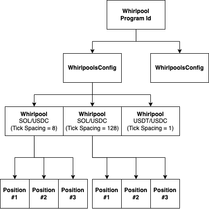

# Orca Whirlpools Py - Python Library for Orca CLAMM Position Management

## Description:
Orca Whirlpools Py is a robust Python library and suite of terminal tools developed to streamline the management of positions within the Orca CLAMM(Concentrated Liquidity Automatic Market Maker) ecosystem. This library provides a convenient interface for interacting with Orca CLAMM, facilitating the creation, monitoring, and adjustment of positions within automated market making strategies.

## Key Features:

* Seamless Integration: Orca Whirlpools Py seamlessly integrates with Orca CLAMM, allowing users to effortlessly manage positions within their market making strategies.
* Simplified Position Management: With Orca Whirlpools Py, users can easily create, monitor, and adjust positions, enabling efficient trading within the Orca CLAMM ecosystem.
* Increase/Decrease Liquidity: Orca Whirlpools Py empowers users to dynamically adjust liquidity levels within their positions, enabling precise control over trading strategies and market exposure.
* List Whirlpools: Orca Whirlpools Py provides functionality to list all whirlpools associated with a user's account, allowing for easy monitoring and management of multiple positions simultaneously.
* Terminal Tools: Orca Whirlpools Py includes a suite of terminal tools, providing a user-friendly command-line interface for interacting with Orca CLAMM and managing positions.
* Extensive Documentation: Comprehensive documentation and examples are provided to guide users in effectively utilizing Orca Whirlpools Py for their position management needs.
* Flexible Customization: Orca Whirlpools Py offers flexibility for customization, allowing users to tailor their position management strategies to suit their specific requirements and preferences.

## Concept
### Concentrated Liquidity Market Maker (CLMM)
- A Concentrated Liquidity Market Maker (CLMM) is a liquidity model that allows liquidity providers (LPs) to allocate their tokens within a selected price range where they will be actively used. Instead of distributing liquidity evenly across an infinite range as in traditional Automated Market Makers (AMMs), CLMMs allow for the pooled funds to be utilized more efficiently within the market or exchange.

- Traders can select a specific price range for their tokens, focusing on liquidity where they anticipate market activity. However, using concentrated liquidity market makers (CLMMs) can result in potential losses similar to those associated with active market-making within a traditional order book market.

### Whirlpool
### Position
### Liquidity
### Why is it important to actively manage your positions?

In CLMMs, there is a need for constant engagement in the market. The LPs and traders must be active to keep their concentrated positions more secure and tight within the price range. They would have to closely monitor their positions and frequently adjust to set up new ranges once the price moves up to the set price boundaries.

Active management helps to reduce the chances of impermanent loss and zero fees. Also, it is less expensive to manage concentrated liquidity market makers (CLMMs). Unlike on Ethereum Virtual Machine, the execution fees cost less on Solana and do not have scalability issues.

Close-range liquidity supply earns more fees than liquidity spread out on a much larger scale. Concentrated ranges ensure effective liquidity deployment. However, to maintain the set position and supply liquidity requires active participation. 

### What is the difference between a CLAMM and a traditional exchange?
There are two major ways to trade cryptocurrencies: traditional orderbook exchanges (CLOBs) and automated market maker (AMM/CLAMM) protocols. Orderbooks look to match sellers and buyers based on price and amount of tokens to trade. In AMMs users trade against a pool of tokens, rather than directly with other users. 

For blockchain applications, Orca believes that CLAMM-based trading protocols are the superior approach because of their simplicity and composability and that with proper education and the right tools a CLAMM can achieve everything a CLOB can and more.

### Can I withdraw my liquidity at any time?
Yes, the Orca protocol allows you to withdraw liquidity at any time.

### Can liquidity providers collect protocol fees?
No, the protocol fee is not for the liquidity provider. The protocol fee is a portion of the total fee collected from the user during a swap on the Whirlpool protocol, and it is diverted to a specific wallet designated for the protocol treasury. This protocol fee is managed separately and can only be collected by the entity authorized by the WhirlpoolConfig's collectProtocolFeesAuthority. The remaining portion of the fee after deducting the protocol fee is distributed to the liquidity providers as their fee. Therefore, the protocol fee is distinct from the fee received by the liquidity provider.

### How much Orca requires to charge fees to create a pool or a position?
Orca does not charge fees to create a pool, nor to create a position in an existing pool. However, network and rent fees are payable and if the Match deposit ratio function is used trading fees and network fees will also be payable on that transaction.

Users of the SDK can reduce position NFT related fees by using openPosition without Metadata - for detail liaise with a Developer Advocate in
### Research and learning should be engaged with before diving in

- With fully permissionless pool creation anyone can create a pool on Orca.
### Account Architecture

### Tick Spacing
<table>
<thead>
<tr>
    <th>Tick Spacing</th>
    <th>Default Fee Rate</th>
</tr>
</thead>
<tbody>
<tr>
    <td>1</td>
    <td>0.01%</td>
</tr>
<tr>
    <td>8</td>
    <td>0.05%</td>
</tr>
<tr>
    <td>64</td>
    <td>0.3%</td>
</tr>
<tr>
    <td>128</td>
    <td>1.0%</td>
</tr>
</tbody>
</table>

## Aim
- open position
- close position
- collect fees
- trasfer rewars to owner wallet

## Dependencies
This library have been tested in the following environment.

* Python: 3.10.6
* solders: 0.18.1
* solana: 0.30.2
* anchorpy: 0.18.0

## Installation
```commandline
pip install -r requirements.txt
```

## Run

```commandline
python3 main.py
```
## For more details
Try to browser files of doc folder.