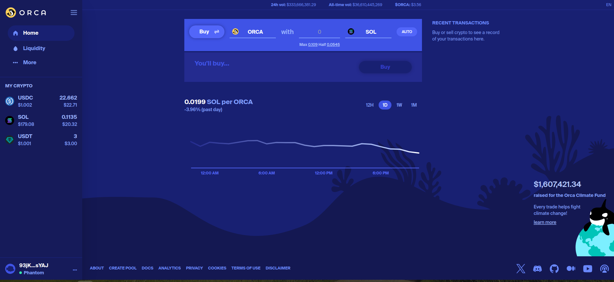
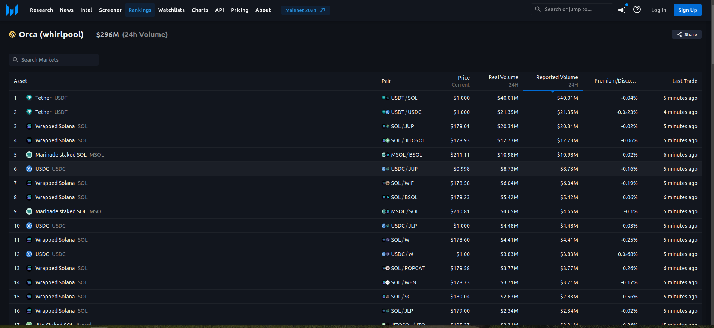

# Orca Whirlpools Py - Python Library for Orca CLAMM Position Management

## Description:
Orca Whirlpools Py is a robust Python library and suite of terminal tools developed to streamline the management of positions within the Orca CLAMM(Concentrated Liquidity Automatic Market Maker) ecosystem. This library provides a convenient interface for interacting with Orca CLAMM, facilitating the creation, monitoring, and adjustment of positions within automated market making strategies.

## Key Features:

* Seamless Integration: Orca Whirlpools Py seamlessly integrates with Orca CLAMM, allowing users to effortlessly manage positions within their market making strategies.
* Simplified Position Management: With Orca Whirlpools Py, users can easily create, monitor, and adjust positions, enabling efficient trading within the Orca CLAMM ecosystem.
* Increase/Decrease Liquidity: Orca Whirlpools Py empowers users to dynamically adjust liquidity levels within their positions, enabling precise control over trading strategies and market exposure.
* List Whirlpools: Orca Whirlpools Py provides functionality to list all whirlpools associated with a user's account, allowing for easy monitoring and management of multiple positions simultaneously.
* Terminal Tools: Orca Whirlpools Py includes a suite of terminal tools, providing a user-friendly command-line interface for interacting with Orca CLAMM and managing positions.
* Extensive Documentation: Comprehensive documentation and examples are provided to guide users in effectively utilizing Orca Whirlpools Py for their position management needs.
* Flexible Customization: Orca Whirlpools Py offers flexibility for customization, allowing users to tailor their position management strategies to suit their specific requirements and preferences.

## Project Vision

The features mentioned in that section must be implemented through Python scripts.
[Liquidity Terminal: How to Guides](https://docs.orca.so/orca-for-liquidity-providers/liquidity-terminal-how-to-guides)

## Why?

Why do we need to develop these library and terminal tools

### Concept

#### [What is Orca?](https://docs.orca.so/orca-for-liquidity-providers/master)

Orca is the easiest place to trade cryptocurrency on the Solana blockchain. On Orca, you can trade tokens cheaply, quickly, and confidently (thanks to the Fair Price Indicator) and with low slippage (thanks to the capital efficiency of Orca's CLAMM pools). Additionally, you can provide liquidity to Orca's concentrated liquidity (CLAMM) pools to earn trading fees and token emissions.

#### Concentrated Liquidity Market Maker (CLMM)
*-* A Concentrated Liquidity Market Maker (CLMM) is a liquidity model that allows liquidity providers (LPs) to allocate their tokens within a selected price range where they will be actively used. Instead of distributing liquidity evenly across an infinite range as in traditional Automated Market Makers (AMMs), CLMMs allow for the pooled funds to be utilized more efficiently within the market or exchange.

*-* Traders can select a specific price range for their tokens, focusing on liquidity where they anticipate market activity. However, using concentrated liquidity market makers (CLMMs) can result in potential losses similar to those associated with active market-making within a traditional order book market.

#### Whirlpool

- [Whirlpool (Orca): A Concentrated Liquidty AMM on Solana](https://dune.com/ilemi/whirlpool)

    Whirlpool is the newest AMM from Orca (launched in March 2022) that uses concentrated liquidity. That means users can choose which ticks they can supply liquidity to, and each pool has a different number of ticks and fees.

- [Orca Liquidity Whirlpools](https://docs.compendium.finance/cmfi-token/staking-and-liquidity-pools/orca-liquidity-whirlpools)

    Orca offers liquidity providers to strategically place their deposits into a concentrated liquidity program called “Whirlpools.”

#### [Position](https://orca-so.gitbook.io/orca-developer-portal/whirlpools/architecture-overview/tokenized-positions)

Whirlpool Position ownership is represented by a single non-fungible token in the owner's wallet.

When creating a tokenized position on Whirlpools, you have the option of whether to append metaplex metadata onto the token with open_position_with_metadata. Doing so will allow your token to be recognized as a Whirlpools NFT in Solana wallets (ex. Phantom). The drawback is your instruction call would consume more compute-budget.

#### Liquidity

Orca’s liquidity: 

### Article urls

- [News about Orca](https://cryptonews.net/news/market/11657859/)-Orca is Uniswap V3 on Solana, Thanks to Open Source Code and Grants
- [News about Orca](https://cryptonews.net/news/market/11657859/)-Orca is Uniswap V3 on Solana, Thanks to Open Source Code and Grants

- [Orca Whirlpools Brings Concentrated Liquidity to Solana](https://blockworks.co/news/orca-whirlpools-brings-concentrated-liquidity-to-solana)
- [Orca: Solana's Human-Friendly Automated Market Maker
](https://messari.io/report/orca-solanas-human-friendly-automated-market-maker)

### DEX urls

- [Orca | DeFi for people, not programs](https://messari.io/exchange/orca-whirlpool)
    
    

- [messari.io](https://messari.io/exchange/orca-whirlpool)
    
    

#### Why is it important to actively manage your positions?

- In CLMMs, there is a need for constant engagement in the market. The LPs and traders must be active to keep their concentrated positions more secure and tight within the price range. They would have to closely monitor their positions and frequently adjust to set up new ranges once the price moves up to the set price boundaries.

- Active management helps to reduce the chances of impermanent loss and zero fees. Also, it is less expensive to manage concentrated liquidity market makers (CLMMs). Unlike on Ethereum Virtual Machine, the execution fees cost less on Solana and do not have scalability issues.

- Close-range liquidity supply earns more fees than liquidity spread out on a much larger scale. Concentrated ranges ensure effective liquidity deployment. However, to maintain the set position and supply liquidity requires active participation. 

### FAQ

- [Which wallets can I use with Orca?](https://docs.orca.so/orca-for-liquidity-providers/master#which-wallets-can-i-use-with-orca)

- [Has Orca been audited?](https://docs.orca.so/orca-for-liquidity-providers/master#has-orca-been-audited)

- [What are the risks of using Orca?](https://docs.orca.so/orca-for-liquidity-providers/master#what-are-the-risks-of-using-orca)

- [Why would I provide liquidity on Orca?](https://docs.orca.so/orca-for-liquidity-providers/master#why-would-i-provide-liquidity-on-orca)

    Each time a trade routes through your selected SOL/USDC pool, a fee is paid by the trader (the taker), a part of which is shared amongst the liquidity providers (the makers), see Trading fees for details. These fees can be harvested at any time.

- [How do I earn fees on Orca?](https://docs.orca.so/orca-for-liquidity-providers/master#how-do-i-earn-fees-on-orca)

    When you provide liquidity in a pool you earn a maker fee from each trade executed against your liquidity, some pools also attract rewards. All earned yields are harvestable at any time.

- [As a liquidity provider do I get ORCA tokens as a reward?](https://docs.orca.so/orca-for-liquidity-providers/master#how-is-the-current-price-in-a-pool-determined)

    Occasionally Orca may distribute ORCA token rewards to incentivize deeper liquidity for certain trading pairs. Pools eligible for ORCA rewards are clearly marked in the explorer. Pools not eligible for ORCA rewards will yield trading fees, composed of the asset pair provided. 

- [How is the current price in a pool determined?](https://docs.orca.so/orca-for-liquidity-providers/master#how-is-the-current-price-in-a-pool-determined)

    The current price for an existing pool is determined by market action alone, through trading, Orca cannot amend, change, nor interfere with a current price within a pool, even if the pool is empty.

    The initial price in a new pool is set by the pool creator.

    To avoid loss, it is critical that users check the current price matches their expectation before depositing liquidity to a pool, and that pool creators take care when setting the initial price.

- [How are preset price ranges calculated, and how do you create a custom range?](https://docs.orca.so/orca-for-liquidity-providers/master#how-are-preset-price-ranges-calculated-and-how-do-you-create-a-custom-range)

- [What happens if the price goes above or below my limits?](https://docs.orca.so/orca-for-liquidity-providers/master#what-happens-if-the-price-goes-above-or-below-my-limits)

    Trading action causes a pool's current price and token balances to fluctuate continuously. 

    As the current price moves towards the max limit of a position,  token-A is rising in value, in relative terms, against token-B and will be sold concurrently for token-B. At the max limit all of token-A will have been sold and the position will be made up entirely of token-B.

    The opposite occurs as the current price moves towards the min limit of a position.

    Once the current price has reached or passed the min or max limits the position becomes dormant, is no longer providing liquidity, and consequently will no longer earn incentives or trading fees. If the price subsequently moves within the position's range, liquidity, incentives and trading fees will recommence.
- [How can I provide liquidity if my position is out-of-range?](https://docs.orca.so/orca-for-liquidity-providers/master#how-can-i-provide-liquidity-if-my-position-is-out-of-range)

    If your position is out-of-range, you can either wait for it to return to the price range (if expected) or provide liquidity in a new range.

    Should you wish to set a new range, you will need to withdraw your liquidity and rebalance. Since the tokens withdrawn and deposited will not match the deposit ratio of an in-range position it will be necessary to trade in order to match the deposit ratio of the new range, you can do this using the Match deposit ratio toggle in the deposit modal.

## How to implement

*-* Development Speicifcations

- Language: Python
- Libraries: anchorpy, solana, solders
- Excluded: No Typescript/Javascript or random SDK.
This library must be developed in Python to integrate with existing Python projects.

*-* Research
- [Orca developer portal](https://orca-so.gitbook.io/orca-developer-portal)
- [A Note for Python Devs](https://orca-so.gitbook.io/orca-developer-portal/whirlpools/interacting-with-the-protocol/a-note-for-python-devs)
Python developers are able to interact with Whirlpool through Whirlpool Essential library!
Whirlpool Essentials library contains almost functions provided by SDK for Typescript.
- Already developed python library called [whirlpool-essentials](https://pypi.org/project/whirlpool-essentials/) 0.0.5
A core library to interact with Orca Whirlpool

*-* Development Methodology

- A Typescript orca SDK was already developed, but one for Python did not exist yet. Referencing Typescript SKD sample will be helpful.

- We will use whirlpool_essentials.py as the default library.

## Development History-For Maintainers

- [Developer guide](./Developer_guide.md)

## User guide-For terminal tool Users

- [ORCA Script CLI](./User_guide.md)

Notes:

- Replace [options] with the appropriate options for each command. 
- All commands support both long and short option formats.
- Ensure that you have the necessary permissions and tokens required for performing the operations.
- For more details on each command and its options, use the --help option with the command (e.g., orca open-position --help).
- Now you're ready to use the ORCA Script CLI to manage your DeFi positions efficiently from the terminal! If you encounter any issues or need further assistance, refer to the documentation or contact the ORCA support team.

# Future plan

## Trending of Orca

- [Orca pool simulator](https://simulate.hawksight.co/)

- [Concentrated Liquidity Yield Optimizer for Active LPs on Solana-www.hawksight.co](https://www.hawksight.co/)

- [The DEFI revolution driven by AI](https://www.orcaprotocol.tech/)
    
    Introducing Orca Protocol, inspired by the revolutionary AI framework developed by Microsoft that derives knowledge from the exceptional GPT-4 neural network, shattering limitations in the realm of open-source AI capabilities.

- [Solana Vault Strategy Protocol-tulip](https://www.orcaprotocol.tech/)
    
    [It supports Orcal pool](https://tulip-protocol.gitbook.io/tulip-protocol/tulip-autovaults/v2-vaults/supported-pools/orca-protocol)

## Future Task

Those are features I can imagine to add to that tool, as soon as we are done with the first project. 

1. Creating django rest framework, where all the functionality is now accessable with an REST API, plus new calls like
	- configure get
		- public key
	- confgure set
		- private key
	- swap, from token to token
	- autoswap, if token amount of token0 or token1 is not enough for position
	- show current and past data/positions (from database)
1. Database
  
   This includes the structure, init sql file and fields for all data necessary for later financial analysis as  well as the program code to interface with the database. The database itself can run in a docker container. Database to use is postgresql. The functionality for database interactions shall include as well calculations for PnL of positions, fees ...
	- Postgres database storing all information like
		- existing positions
		- past positions
		- collected fees
		- swapped tokens
1. Integration of other Dexes
   
   There are other CLMM Pools, which are interesting to integrate. However, to my knowledge at least RAY has no Python SDK, but python is the language we stick to.
	- 1. Raydium
	- 2. Meteor

1. Exploration and integration of other def/dex instruments like
	- 1. Kamino Finance
	- 2. MarginFi
	- 3. Solend

I think best order of those features is:

1. Database Support
2. Integration of Dexes
3. PnL Track

    [How do I track PnL ](https://docs.orca.so/orca-for-liquidity-providers/master#how-do-i-track-pnl-profit-and-loss-after-providing-liquidity-in-pools)

Then we check state and what makes sense next.
